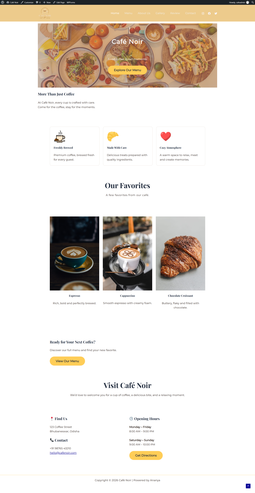
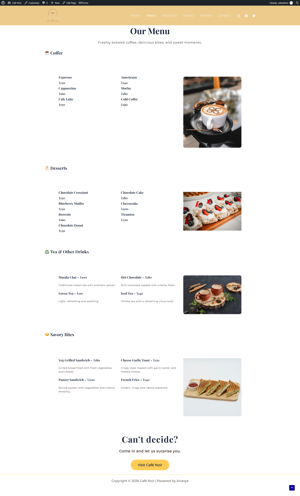
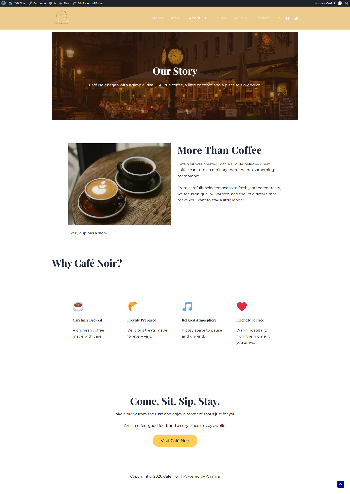
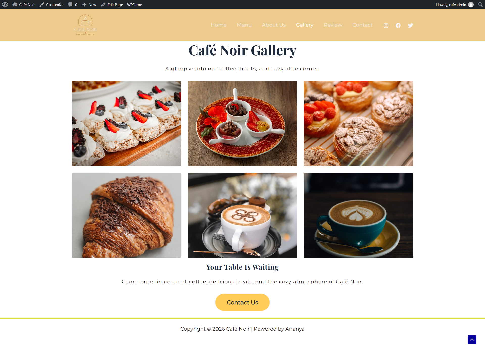
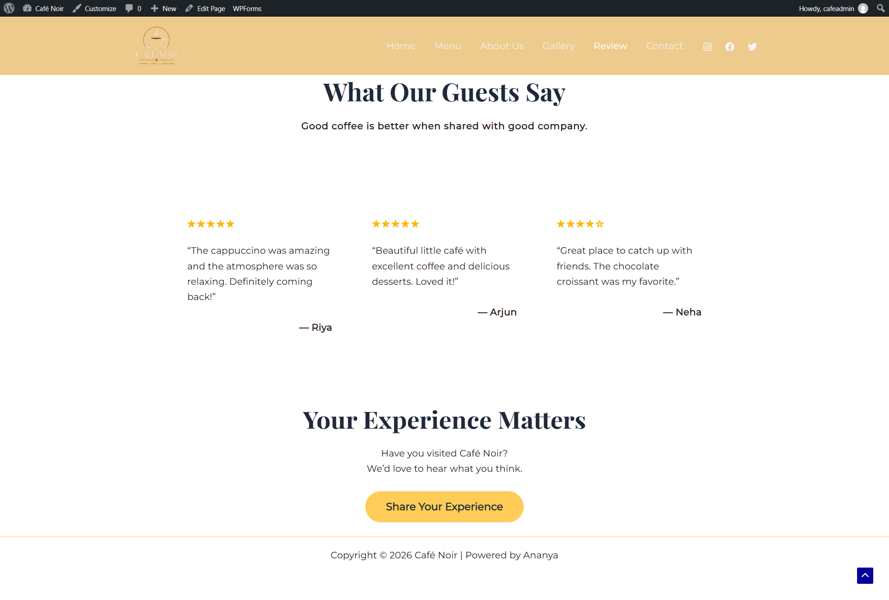
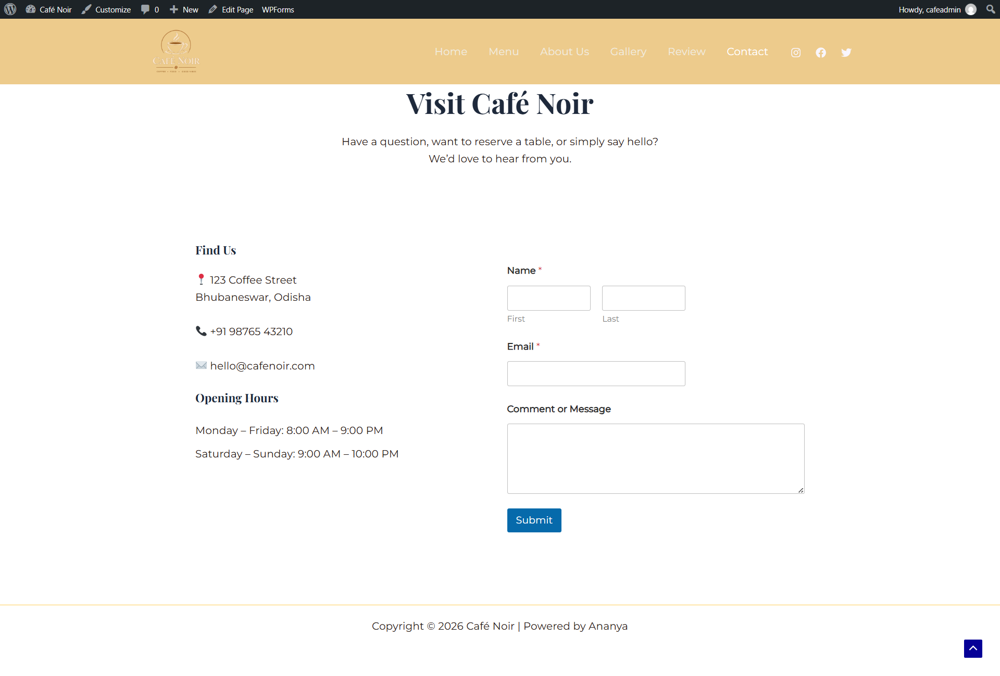

# Café Noir ☕️

> Good coffee. Good moments.

A modern café website designed and built with WordPress, focusing on a warm visual identity, clean layouts, and a simple user experience.

## 📸 Preview

### Home

### Menu

### About Us

### Gallery

### Reviews

### Contact

## ✨ Features

- ☕ Café-focused modern design
- 🎨 Custom color palette and typography
- 📋 Dedicated menu page
- 🖼️ Café image gallery
- ⭐ Customer reviews section
- 📩 Contact form
- 📍 Café location and opening hours
- 🗺️ Google Maps directions
- ✨ Interactive card hover effects
- 🔘 Button hover animations
- 📌 Sticky navigation header
- 📱 Mobile navigation menu

## 🛠️ Technologies Used

- WordPress
- Astra Theme
- Gutenberg Block Editor
- CSS
- WPForms
- WAMP
- MySQL

## 🎨 Design

The visual design uses a warm café-inspired palette:

- Background: `#F7F3EE`
- Primary: `#3B2418`
- Secondary: `#8B5E3C`
- Text: `#241A15`
- Accent: `#C89B6D`

Typography:

- Headings: Playfair Display
- Body: Montserrat

## 📄 Pages

| Page | Description |
|------|-------------|
| Home | Café introduction, highlights and call-to-action |
| Menu | Coffee, desserts, drinks and savory items |
| About Us | Café story, philosophy and values |
| Gallery | Café atmosphere and food showcase |
| Reviews | Customer feedback and ratings |
| Contact | Contact form, location and opening hours |

## 💡 Project Highlights

This project helped me practice:

- WordPress website setup
- Theme customization
- Gutenberg block-based page building
- Custom CSS
- Navigation and menus
- Responsive mobile navigation
- Interactive hover effects
- Contact form integration
- Local WordPress development using WAMP
- Git and GitHub version control

## 📌 Project Type

**WordPress Website / UI Design Project**

## 👩‍💻 Author

**Ananya Dash**

Frontend Developer & UI/UX Enthusiast